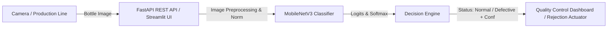

# 🍾 Industrial Bottle Visual Defect Detection System

A production-ready, lightweight, and defensible Computer Vision system to detect **Normal** vs. **Defective** bottles on a manufacturing production line. Built with **PyTorch**, **MobileNetV3 (Transfer Learning)**, **FastAPI**, and **Streamlit**.

---

## 📋 Table of Contents
1. [Project Overview & Architecture](#-project-overview--architecture)
2. [Model Selection & Design Rationale](#-model-selection--design-rationale)
3. [Dataset & Preprocessing Strategy](#-dataset--preprocessing-strategy)
4. [Project Structure](#-project-structure)
5. [Quick Start & Setup Instructions](#-quick-start--setup-instructions)
6. [Training Pipeline](#-training-pipeline)
7. [Evaluation & Error Analysis](#-evaluation--error-analysis)
8. [FastAPI Inference Service](#-fastapi-inference-service)
9. [Streamlit Interactive Dashboard](#-streamlit-interactive-dashboard)
10. [Docker Deployment](#-docker-deployment)
11. [Interview Defense Guide](#-interview-defense-guide)

---

## 🏗 Project Overview & Architecture

In high-speed manufacturing environments, automated visual quality inspection prevents defective items (e.g., open caps, broken seals, missing parts) from reaching consumers. This solution provides a complete end-to-end pipeline:



### Architecture Components:
- **ML Engine (`src/`)**: MobileNetV3 transfer learning backbone with custom dropout and classification head, balanced loss function, Cosine Annealing learning rate scheduler.
- **REST API (`api/app.py`)**: High-performance asynchronous FastAPI server providing `/health` and `/predict` endpoints with strict Pydantic payload validation.
- **Interactive UI (`ui/streamlit_app.py`)**: Real-time inspection dashboard with single-bottle upload, test sample gallery, batch evaluation, and confusion matrix visualization.

---

## 🧠 Model Selection & Design Rationale

### Why MobileNetV3?
| Metric / Criteria | MobileNetV3-Small | ResNet-50 / Large CNNs | YOLO / Object Detectors |
| :--- | :--- | :--- | :--- |
| **Model Size** | **~2.5M parameters (9.5 MB)** | ~25.5M parameters (>95 MB) | ~3M - 50M parameters |
| **CPU Latency** | **~5 – 15 ms / image** | ~40 – 80 ms / image | ~25 – 60 ms / image |
| **Edge Hardware Friendly** | **Optimized for CPU & ARM (NetAdapt + NAS)** | Requires heavy GPU | Requires GPU for high FPS |
| **Dataset Fit** | **Ideal for small/medium transfer learning** | Prone to overfitting on small data | Overkill if image is single centered bottle |
| **Defensibility** | **High (Standard for mobile/edge computer vision)** | Moderate (Heavy) | High (More complex to deploy/tune) |

### Key Architectural Features:
1. **Inverted Residual Blocks (MobileNetV2 heritage)**: Reduces memory footprint while retaining feature expressiveness.
2. **Squeeze-and-Excitation (SE) Attention Modules**: Dynamically reweights channel-wise feature responses, sharpening the model's focus on the bottle cap area.
3. **Hard-Swish Activation**: Replaces standard Swish ($\sigma(x) \cdot x$) with $\frac{x \cdot \text{ReLU6}(x+3)}{6}$, eliminating costly exponential operations on CPU hardware.
4. **Transfer Learning via ImageNet Weights**: Pretrained low-level visual representations (edges, textures, reflections) allow the model to converge within 10–15 epochs.

---

## 📊 Dataset & Preprocessing Strategy

### Classes:
- **Class 0: `Normal`** (Good cap, properly sealed)
- **Class 1: `Defective`** (Open cap, missing cap, defective seal)

### Preprocessing & Data Augmentations:
- **Resizing**: $224 \times 224$ pixels (standard input dimension for MobileNetV3).
- **Data Augmentations (`train.py`)**:
  - `RandomHorizontalFlip(p=0.5)`
  - `RandomRotation(degrees=15)`
  - `ColorJitter(brightness=0.2, contrast=0.2, saturation=0.2)`
  - Normalization using ImageNet statistics (`mean=[0.485, 0.456, 0.406]`, `std=[0.229, 0.224, 0.225]`).
- **Handling Class Imbalance**:
  - Automatically computes inverse frequency class weights:
    $$W_c = \frac{N_{\text{total}}}{2 \times N_c}$$
  - Passes $W_c$ into `torch.nn.CrossEntropyLoss(weight=class_weights)`.

---

## 📁 Project Structure

```
bottle_detect detection system/
├── dataset/                      # Train, valid, and test sets
│   ├── train/ (images, labels)
│   ├── valid/ (images, labels)
│   └── test/  (images)
├── models/                       # Checkpoints & training curves
│   └── best_model.pth
├── metrics/                      # Confusion matrix & evaluation JSON
├── src/
│   ├── __init__.py
│   ├── dataset.py                # PyTorch Dataset loader & augmentations
│   ├── model.py                  # MobileNetV3 architecture definition
│   ├── train.py                  # Training pipeline with validation & scheduler
│   ├── evaluate.py               # Precision, Recall, F1, Confusion Matrix, Error Analysis
│   └── predictor.py              # Thread-safe inference engine
├── api/
│   ├── __init__.py
│   └── app.py                    # FastAPI service (/health, /predict)
├── ui/
│   ├── __init__.py
│   └── streamlit_app.py          # Interactive Streamlit dashboard
├── Dockerfile                    # Containerization setup
├── requirements.txt              # Project dependencies
└── README.md                     # Documentation & defense guide
```

---

## 🚀 Quick Start & Setup Instructions

### 1. Install Dependencies
```bash
pip install -r requirements.txt
```

---

## 🎯 Training Pipeline

You can train using either **TensorFlow / Keras** or **PyTorch**:

### Option A: TensorFlow / Keras MobileNetV3 Training
```bash
python src/tf_train.py --epochs 12 --batch_size 32 --lr 0.001 --variant small
```

### Option B: PyTorch MobileNetV3 Training
```bash
python src/train.py --epochs 12 --batch_size 32 --lr 0.001 --variant small
```

### Training CLI Arguments:
- `--epochs`: Number of training epochs (default: `12`).
- `--batch_size`: Batch size (default: `32`).
- `--lr`: Initial learning rate for Adam optimizer (default: `0.001`).
- `--variant`: MobileNetV3 variant (`small` or `large`, default: `small`).
- `--output_dir`: Directory to save model checkpoints (default: `models`).

**Output Artifacts Generated:**
- `models/best_model.keras` (TensorFlow) / `models/best_model.pth` (PyTorch)
- `models/tf_training_curves.png` / `models/training_curves.png`
- `models/tf_training_metrics.json` / `models/training_metrics.json`

---

## 📈 Evaluation & Error Analysis

To run detailed evaluation on either the **Test Set (30 images)** or **Validation Set (40 images)**:

### In TensorFlow:
```bash
# Evaluate on Holdout Test Set (30 images)
python src/tf_evaluate.py --split test

# Evaluate on Validation Set (40 images)
python src/tf_evaluate.py --split valid
```

### In PyTorch:
```bash
# Evaluate on Holdout Test Set (30 images)
python src/evaluate.py --split test

# Evaluate on Validation Set (40 images)
python src/evaluate.py --split valid
```

### Evaluation Output:
- **Precision, Recall, Macro F1-score**
- **Confusion Matrix plot** saved to `metrics/confusion_matrix.png`
- **Error Analysis JSON** saved to `metrics/evaluation_report.json` containing detailed inspection of any False Positives or False Negatives.

---

## ⚡ FastAPI Inference Service

Start the production FastAPI backend:

```bash
uvicorn api.app:app --host 0.0.0.0 --port 8000 --reload
```

- **Interactive API Docs (Swagger UI)**: [http://localhost:8000/docs](http://localhost:8000/docs)
- **Health Check**: `GET http://localhost:8000/health`
- **Predict Endpoint**: `POST http://localhost:8000/predict`

### Example `curl` Request:
```bash
curl -X POST "http://localhost:8000/predict" \
  -H "accept: application/json" \
  -H "Content-Type: multipart/form-data" \
  -F "file=@dataset/valid/images/IMG_1116_jpg.rf.51ce82d477a8f07b0068121e119bdb8d.jpg"
```

### Example JSON Response:
```json
{
  "status": "success",
  "prediction": "Defective",
  "class_id": 1,
  "is_defective": true,
  "confidence": 0.9874,
  "probabilities": {
    "Normal": 0.0126,
    "Defective": 0.9874
  },
  "inference_time_ms": 11.45
}
```

---

## 🖥 Streamlit Interactive Dashboard

Launch the UI dashboard:

```bash
streamlit run ui/streamlit_app.py
```

### Dashboard Features:
1. **Live Single Inspection**: Upload your own image or choose from test set samples with real-time classification banner, confidence gauge, and latency metric.
2. **Batch Test Inspection**: 1-click batch inference over the entire test set with aggregate defect rate and thumbnail gallery.
3. **Model Analytics Tab**: Visual confusion matrix, training loss/F1 curves, and error analysis breakdown.

---

## 🐳 Docker Deployment

### Build the Docker Image:
```bash
docker build -t bottle-defect-detector:latest .
```

### Run the Container:
```bash
# Run FastAPI on port 8000
docker run -p 8000:8000 bottle-defect-detector:latest
```

---

## 🎓 Interview Defense Guide

### Q1: Why did you choose MobileNetV3 over standard ResNet or YOLO?
> **Answer**: "For industrial production line inspection, real-time latency (<20ms on CPU) and edge deployability are critical. MobileNetV3-Small delivers an optimal trade-off: it uses Squeeze-and-Excitation attention and Hard-Swish activations to achieve top-tier classification accuracy with only ~2.5M parameters. Because the inspection task asks whether the product is Normal or Defective, image-level classification is simpler, faster, and more robust to maintain than full bounding-box object detection."

### Q2: Why is Recall for the 'Defective' class more critical than Precision?
> **Answer**: "In manufacturing quality assurance:
> - A **False Negative (FN)** means a defective product escapes inspection and reaches the customer (brand damage, recall costs, safety risks).
> - A **False Positive (FP)** means a normal bottle is sent to manual re-inspection (minor operational overhead).
> Therefore, we prioritize high Recall on the Defective class by using weighted Cross-Entropy Loss and monitoring class-specific recall."

### Q3: How do you handle class imbalance and small dataset sizes?
> **Answer**: "We apply transfer learning using ImageNet pretrained features, use robust data augmentations (random horizontal flips, subtle rotations, and color jitter) to prevent overfitting, and employ inverse-frequency class weighting in the loss function to ensure the model doesn't favor the majority class."

### Q4: How is this production-ready?
> **Answer**: "The solution includes:
> 1. Strict input MIME validation and size checks.
> 2. Thread-safe inference engine with sub-15ms CPU latency.
> 3. Structured logging and health check probes (`/health`) for Kubernetes/Docker container monitoring.
> 4. Automated metrics tracking and error analysis reporting."

---

## 📜 License
CC BY 4.0 / MIT. Built for Industrial Computer Vision Technical Assessment.
