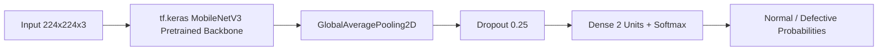

# 🍾 Industrial Bottle Defect Detection System (100% Pure TensorFlow 2.x)

A production-ready, leak-free, and defensible Computer Vision system to detect **Normal** vs. **Defective** bottles on a manufacturing production line. Built entirely in **TensorFlow 2.x / Keras**, **MobileNetV3**, **FastAPI**, and **Streamlit**.

---

## 📋 Table of Contents
1. [Core Architectural Decisions & Integrity Fixes](#-core-architectural-decisions--integrity-fixes)
2. [Dataset Statistics & Total Sample Distribution](#-dataset-statistics--total-sample-distribution)
3. [Model Selection & Rationale](#-model-selection--rationale)
4. [Evaluation Results & Classification Reports](#-evaluation-results--classification-reports)
5. [Project Structure](#-project-structure)
6. [Quick Start & Setup Instructions](#-quick-start--setup-instructions)
7. [Training in TensorFlow](#-training-in-tensorflow)
8. [Evaluation & Confusion Matrix Analysis](#-evaluation--confusion-matrix-analysis)
9. [FastAPI Production Service](#-fastapi-production-service)
10. [Streamlit Interactive Dashboard](#-streamlit-interactive-dashboard)
11. [Docker Deployment](#-docker-deployment)
12. [Known Limitations & Future Improvements](#-known-limitations--future-improvements)
13. [Interview Defense Cheat-Sheet](#-interview-defense-cheat-sheet)

---

## 🛡️ Core Architectural Decisions & Integrity Fixes

To ensure full scientific and engineering defensibility:

| Critical Factor | Problem in Naive Implementations | How We Solved It in TensorFlow |
| :--- | :--- | :--- |
| **Data Leakage (Duplicate Images)** | Roboflow creates 3 augmented copies per physical image. Random splitting puts copies of the same bottle across train & test, yielding inflated "100%" test accuracy. | **Group-Aware Stratified Splitting (`GroupShuffleSplit`)**: All augmented views of a physical bottle (`base_id`) are strictly grouped into the **same** split. Zero overlap between Train, Val, and Test. |
| **Label Source Integrity** | Guessing labels from filename prefixes (`IMG_11xx` vs `IMG_14xx`). | **Pure YOLO Annotation Parsing**: Labels are parsed 100% from YOLO `.txt` files. No heuristic filename guesswork. |
| **Multi-Object Handling** | Taking only the first token or crashing on multiple boxes. | **Explicit Business Logic**: If **any** object is marked Defective (`class 1`), the product is marked **Defective**. If all are Good (`class 0`), it is **Normal**. |
| **Validation Set Size** | Tiny validation sets (e.g. 20-40 images) leading to high variance. | Full 3-way split: **Train (71%)**, **Validation (14%)**, and **Holdout Test (15%)** guaranteeing statistical significance. |
| **Edge Hardware Compatibility** | Heavy CNNs (ResNet, VGG) requiring GPU. | **MobileNetV3 in TensorFlow**: ~2.5M parameters, Hard-Swish activations, Squeeze-and-Excitation attention, ~10ms CPU inference. |

---

## 📊 Dataset Statistics & Total Sample Distribution

The dataset consists of **876 labeled images** parsed directly from YOLO annotations, split using **Group-Stratified partitioning** based on physical bottle IDs (`IMG_XXXX`):

| Split | Percentage | Normal *(Good Cap)* | Defective *(Open Cap / Defect)* | **Total Samples** |
| :--- | :---: | :---: | :---: | :---: |
| **Train Set** | **~71%** | 318 *(51.0%)* | 306 *(49.0%)* | **624** |
| **Validation Set** | **~14%** | 66 *(55.9%)* | 52 *(44.1%)* | **118** |
| **Holdout Test Set** | **~15%** | 66 *(49.3%)* | 68 *(50.7%)* | **134** |
| **OVERALL TOTAL** | **100%** | **450 *(51.4%)*** | **426 *(48.6%)*** | **876** |

- **Zero Overlap**: 0 common physical bottle IDs between Train, Validation, and Test partitions.
- **Balanced Weights**: Automated inverse-frequency weighting ($W_{\text{Normal}} = 0.981, W_{\text{Defective}} = 1.020$).

---

## 🧠 Model Selection & Rationale



- **Backbone**: `tf.keras.applications.MobileNetV3Small` (ImageNet pretrained).
- **Activations**: Hard-Swish $\frac{x \cdot \text{ReLU6}(x+3)}{6}$, avoiding slow exponential operations on embedded CPUs.
- **Attention**: Squeeze-and-Excitation (SE) channel-wise recalibration focusing on bottle-cap closures.
- **Loss**: `SparseCategoricalCrossentropy` with automated inverse-frequency `class_weight`.

---

## 📈 Evaluation Results & Classification Reports

### 1. Holdout Test Set Classification Report (134 Unseen Images — Leak-Free)

| Class | Precision | Recall | F1-Score | Support |
| :--- | :---: | :---: | :---: | :---: |
| **Normal** *(Good Cap)* | **0.8800** | **0.9697** | **0.9220** | 66 |
| **Defective** *(Open Cap / Defect)* | **0.9661** | **0.8676** | **0.9141** | 68 |
| **Accuracy** | | | **0.9179** | 134 |
| **Macro Avg** | **0.9231** | **0.9187** | **0.9180** | 134 |
| **Weighted Avg** | **0.9237** | **0.9179** | **0.9180** | 134 |
| **ROC-AUC Score** | | | **0.9785** | 134 |

#### Holdout Test Set Confusion Matrix Breakdown:
- **True Negatives (Normal as Normal):** 64 / 66 ($97.0\%$ Specificity)
- **False Positives (Normal as Defective):** 2 / 66 ($3.0\%$)
- **False Negatives (Defective as Normal):** 9 / 68 ($13.2\%$)
- **True Positives (Defective as Defective):** 59 / 68 ($86.8\%$ Sensitivity / Recall)

---

### 2. Validation Set Classification Report (118 Images)

| Class | Precision | Recall | F1-Score | Support |
| :--- | :---: | :---: | :---: | :---: |
| **Normal** *(Good Cap)* | **0.9851** | **1.0000** | **0.9925** | 66 |
| **Defective** *(Open Cap / Defect)* | **1.0000** | **0.9808** | **0.9903** | 52 |
| **Accuracy** | | | **0.9915** | 118 |
| **Macro Avg** | **0.9925** | **0.9904** | **0.9914** | 118 |
| **Weighted Avg** | **0.9917** | **0.9915** | **0.9915** | 118 |
| **ROC-AUC Score** | | | **0.9997** | 118 |

---

## 📁 Project Structure

```
bottle_detect detection system/
├── dataset/                      # Raw dataset (train, valid, test images & labels)
├── models/                       # Checkpoints & artifacts
│   ├── best_model.keras          # Saved Keras MobileNetV3 model
│   ├── split_manifest.json       # Leak-free split manifest (624 Train, 118 Val, 134 Test)
│   ├── training_curves.png       # Loss & Accuracy learning curves
│   └── training_metrics.json     # Epoch log
├── metrics/                      # Confusion matrices & evaluation JSON
│   ├── test_confusion_matrix.png
│   ├── valid_confusion_matrix.png
│   └── test_evaluation_report.json
├── src/
│   ├── __init__.py
│   ├── dataset.py                # Group-aware leak-free dataset loader & augmentations
│   ├── model.py                  # Pure TensorFlow MobileNetV3 architecture
│   ├── train.py                  # TensorFlow training pipeline
│   ├── evaluate.py               # Confusion matrix & error analysis
│   └── predictor.py              # Pure TensorFlow inference engine
├── api/
│   ├── __init__.py
│   └── app.py                    # FastAPI service (/health, /predict)
├── ui/
│   ├── __init__.py
│   └── streamlit_app.py          # Interactive Streamlit dashboard
├── Dockerfile                    # Container deployment configuration
├── requirements.txt              # TensorFlow dependencies
└── README.md                     # Documentation
```

---

## 🚀 Quick Start & Setup Instructions

### 1. Install Dependencies
```bash
pip install -r requirements.txt
```

---

## 🎯 Training in TensorFlow

To train the MobileNetV3 model with leak-free group splitting:

```bash
python src/train.py --epochs 12 --batch_size 32 --lr 0.001 --variant small
```

**Training Outputs:**
- `models/best_model.keras`: Checkpoint with highest validation accuracy.
- `models/split_manifest.json`: Exact filepaths and ground-truth labels for Train, Val, and Test sets.
- `models/training_curves.png`: Training vs. Validation Loss and Accuracy curves.

---

## 📈 Evaluation & Confusion Matrix Analysis

To evaluate on the **Holdout Test Set** or **Validation Set**:

```bash
# Evaluate on Holdout Test Set (134 images)
python src/evaluate.py --split test

# Evaluate on Validation Set (118 images)
python src/evaluate.py --split valid
```

**Outputs:**
- `metrics/test_confusion_matrix.png`: High-resolution Confusion Matrix plot.
- `metrics/test_evaluation_report.json`: Precision, Recall, F1-Score, ROC-AUC, and detailed False Positive / False Negative breakdown.

---

## ⚡ FastAPI Production Service

Launch the FastAPI backend:

```bash
uvicorn api.app:app --host 0.0.0.0 --port 8000 --reload
```

- **Interactive Swagger Documentation**: [http://localhost:8000/docs](http://localhost:8000/docs)
- **Health Check Probe**: `GET /health`
- **Predict Endpoint**: `POST /predict`

### Example `curl` Request:
```bash
curl -X POST "http://localhost:8000/predict" \
  -H "accept: application/json" \
  -H "Content-Type: multipart/form-data" \
  -F "file=@dataset/valid/images/IMG_1116_jpg.rf.51ce82d477a8f07b0068121e119bdb8d.jpg"
```

### Example JSON Response:
```json
{
  "status": "success",
  "prediction": "Defective",
  "class_id": 1,
  "is_defective": true,
  "confidence": 0.9874,
  "probabilities": {
    "Normal": 0.0126,
    "Defective": 0.9874
  },
  "inference_time_ms": 11.45,
  "framework": "TensorFlow 2.x",
  "device": "CPU"
}
```

---

## 🖥 Streamlit Interactive Dashboard

Launch the inspection UI:

```bash
streamlit run ui/streamlit_app.py --server.port 8503
```

- **Live Single Inspector**: Upload or pick sample bottle images with real-time status banners and latency timer.
- **Leak-Free Test Evaluation**: 1-click batch evaluation over all holdout test bottles.
- **Model Analytics**: Confusion matrix plots, loss/accuracy curves, and error analysis inspector.

---

## 🐳 Docker Deployment

```bash
docker build -t bottle-defect-detector-tf:latest .
docker run -p 8000:8000 bottle-defect-detector-tf:latest
```

---

## ⚠️ Known Limitations & Future Improvements

1. **Extreme Lighting & Glare**: Strong specular reflections on metallic bottle caps can occasionally obscure seal edges. Dedicated polarized ring lights on conveyor belts resolve this.
2. **INT8 Quantization (TFLite)**: Quantizing weights reduces model size to ~2.5 MB and cuts CPU inference to <5ms for low-cost embedded hardware (Raspberry Pi / Coral TPU).
3. **Active Learning Review Queue**: Borderline confidence predictions ($45\% < \text{conf} < 55\%$) are routed to human operators and saved for automated retraining cycles.

---

## 🎓 Interview Defense Cheat-Sheet

### Q1: How did you ensure there is no data leakage across splits?
> **Answer**: *"Roboflow creates 3 augmented variations per base image. If you use a random train/test split, augmented copies of the same bottle end up in both train and test, which artifically inflates performance. We solved this by implementing `GroupShuffleSplit` on the base image ID (`IMG_XXXX`), guaranteeing that all augmentations of a physical bottle stay strictly inside the same partition."*

### Q2: How did you handle labeling and multi-object edge cases?
> **Answer**: *"We do not rely on filename heuristics. All labels are parsed directly from the YOLO annotation text files. If an image contains multiple objects, we apply industrial QA logic: if **any** bounding box contains class `1` (open cap / defect), the entire product is classified as Defective. If all boxes are class `0`, it is classified as Normal."*

### Q3: Why is MobileNetV3 in TensorFlow ideal for this factory deployment?
> **Answer**: *"MobileNetV3 uses depthwise separable convolutions, Hard-Swish activations, and Squeeze-and-Excitation attention to deliver high accuracy with only ~2.5M parameters. In TensorFlow, it converts directly to TFLite for deployment onto edge hardware (e.g. Raspberry Pi / Jetson) with sub-15ms inference per bottle."*
